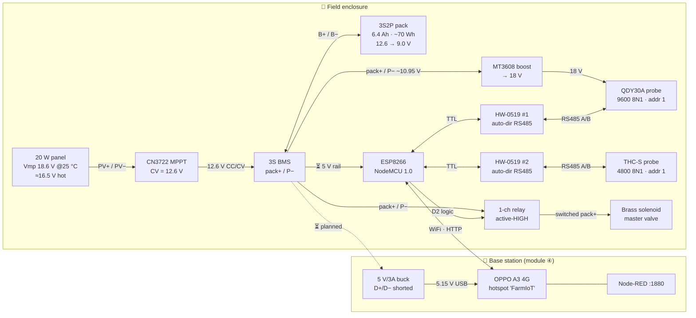

# Deployment Wiring — Ian's farm, as built

> **Scope:** this is the *actual deployment* — one combined `farm-node` (modules ① + ② sensing
> + the master valve), the 3S2P solar pack (module ③), and the Android base station (module ④).
> It is **not** the teaching layout. The module docs deliberately describe **two independent
> nodes** so a farmer can build Module ① alone; this file describes the **one box** we run.
> Where the two differ, both are correct — see [§9 As-built vs as-documented](#9-as-built-vs-as-documented).
>
> **Sources of truth:** pins from `firmware/farm-node/farm-node.ino` (the flashed binary wins over
> every doc), power from `hardware/3S2P.md`, endpoints from `flows/both-sensors-flow.json`.
> **Last reconciled:** 2026-07-26.
>
> ⚠️ **Status legend used throughout:** ✅ built & proven · 🔶 built, intermittent · ⏳ designed, not built.

---

## 1. Whole deployment



**The one sentence version:** panel → MPPT → BMS → pack is the only power source; the pack feeds a
boost (18 V, water probe), the relay (valve), and — once built — a buck (5 V, ESP and phone). All
sensing goes ESP → RS485 → probe, and all reporting goes ESP → WiFi → the phone's Node-RED.

---

## 2. Power tree (voltages at each node)

```
  ☀ 20 W panel
  Voc ≈ 22 V (25 °C) / ~19.5–20 V hot
  Vmp 18.6 V (25 °C) → ≈16.5 V hot          ← tune the MPPT pot to the HOT figure
        │  PV+ / PV−
        ▼
  ┌──────────────────────────────┐
  │ CN3722 MPPT buck charger     │  CV pot → 12.6 V ✅ set
  │  · needs Vin ≳ Vpack + 2 V   │  MPPT pot → ~16.5 V ⏳ not finalised
  │  · max ~1.6 A < 1.92 A limit │  NTC charge-temp cutoff ⏳ not verified (45 °C)
  └──────────────────────────────┘
        │  BAT+ / GND
        ▼
  ┌──────────────────────────────┐
  │ 3S BMS  (B+ B− P−)           │  balance taps, ascending: 0 → 4.2 → 8.4 → 12.6 V
  └──────────────────────────────┘
        │  ⚠ EVERY load taps pack+ / P−, never B−
        ▼
  ┌──────────────────────────────┐
  │ 3S2P pack  6 × INR18650-32E  │  12.6 V full · 10.95 V nom · ~9.0 V near empty
  │  6.4 Ah · ~70 Wh · 53 mΩ     │  charge 0–45 °C ONLY · discharge −20…60 °C
  └──────────────────────────────┘
        │
        ├─[fuse 3 A]─► MT3608 boost ──► 18 V ──► QDY30A probe (red/green)   ✅
        │
        ├─[fuse]────► relay COM/NO ──► brass solenoid coil (~10.9 V)        ⏳ pull-in unverified
        │
        └─[fuse]────► 5 V buck ─┬──► ESP8266 VBUS + HW-0519 VCC(3V3)        ⏳ (ESP on USB today)
                                └──► USB socket, D+ ⎯ D− shorted ──► phone  ⏳
```

**Energy budget that governs all of it:** panel harvests **50–60 Wh clear / 6–15 Wh overcast**;
pack holds ~70 Wh, **~38 Wh everyday-usable**. The phone alone wants 20–57 Wh/day plugged in —
which is why the design duty-cycles the *charger*, not the phone. See `docs/03`.

---

## 3. ESP8266 pin map — **as soldered**, combined node

Board: NodeMCU 1.0 (ESP-12E). Five safe GPIOs exist and all five are spent.

| ESP pin | GPIO | Direction | Goes to | Net |
|---|---|---|---|---|
| **D7** | 13 | in | HW-0519 **#1** `RXD` | water RX |
| **D1** | 5 | out | HW-0519 **#1** `TXD` | water TX |
| **D6** | 12 | in | HW-0519 **#2** `RXD` | soil RX |
| **D5** | 14 | out | HW-0519 **#2** `TXD` | soil TX |
| **D2** | 4 | out | relay `IN` | valve command (**active-HIGH** on this node) |
| **3V3** | — | pwr out | HW-0519 #1 + #2 `VCC` | logic rail |
| **VBUS** | — | pwr | 5 V in / relay `VCC` | ⚠ **VBUS, not VIN** |
| **GND** | — | pwr | common ground star | see §7 |

> **`RXD`/`TXD` on the HW-0519 are named from the ESP's point of view.** The board's `RXD` pad
> carries data *toward* the ESP, so it lands on the ESP's **receive** pin. If the TXD LED blinks
> and RXD never does, the probe isn't replying — swap A/B before touching anything else.

**Pins you must never use, and why:**

| Pin | GPIO | Why it's a trap |
|---|---|---|
| D3 | 0 | boot strap — must be HIGH at boot |
| D4 | 2 | boot strap — must be HIGH at boot |
| D8 | 15 | boot strap — must be LOW at boot |
| D0 | 16 | **no interrupts** → cannot do SoftwareSerial RX at all |

There is no sixth safe pin. Per-row **zone valves therefore need a separate controller (an ESP32)** —
the D2 valve is the master on the 6000 L tank and that doesn't change.

> ⚠️ **NO DE PIN, ever, on this node.** Both boards are HW-0519 auto-direction (they derive
> transmit-enable from TXD via an onboard 74HC04). `water-level.ino` toggles D1 as DE — harmless
> when D1 was unconnected, fatal here, because **D1 is now water's TXD**: driving it would clamp
> the water driver onto the bus and the probe could never reply. Never run `water-level.ino` on
> this board, and never add a DE pin back to `farm-node.ino`.

---

## 4. Water bus (module ①) — 9600 8N1, slave addr 1 🔶

```
   ┌── pack+ ──► MT3608 IN+          MT3608 OUT+ ──18 V──► probe RED
   │   P−   ──► MT3608 IN−          MT3608 OUT− ─────────► probe GREEN ──┐
   │                                                                     │
   │   probe BLUE  (A+) ─────────────────► HW-0519 #1  A                 │
   │   probe YELLOW (B−) ────────────────► HW-0519 #1  B                 │
   │                                                                     │
   │   HW-0519 #1  RXD ──────────────────► ESP D7                        │
   │   HW-0519 #1  TXD ◄────────────────── ESP D1                        │
   │   HW-0519 #1  VCC ──────────────────► ESP 3V3                       │
   │   HW-0519 #1  GND ──────────────────► COMMON GND ◄──────────────────┘
```

| Wire | From | To | Note |
|---|---|---|---|
| Red | MT3608 `OUT+` | probe **red** | **18 V — this wire and nothing else.** 18 V into the MAX485 or the ESP destroys both |
| Green | MT3608 `OUT−` | probe **green**, common GND | 🔶 **prime suspect for the intermittent** |
| Blue | probe **blue** | HW-0519 #1 `A` | A+ |
| Yellow | probe **yellow** | HW-0519 #1 `B` | B− |

- **Set the MT3608 to 18 V with nothing on the output, before the probe is ever connected.** The
  trimmer is a 25-turn part with no end stops — it spins freely while doing nothing. Watch a meter.
- Register `0x0004`, **signed int16**, **1 count = 1 mm** (ruler-confirmed). Dry offset on our probe
  is **26 counts** — measure yours in air.
- 🔶 **BLOCKER:** this bus reads, then goes silent, then reads again on identical code and wiring.
  Firmware, radio, boost and A/B are all eliminated by test. It's a wire — wiggle-test it while the
  node polls, **before anything is soldered into a box.** Likely the same fault as the FT232 dropout.

---

## 5. Soil bus (module ②, sensing half) — 4800 8N1, slave addr 1 ✅

```
   probe BROWN (+)  ──────► pack+ (4.5–30 V, no regulator needed)
   probe BLACK (−)  ──────► P− / COMMON GND
   probe YELLOW (A+) ─────► HW-0519 #2  A
   probe BLUE   (B−) ─────► HW-0519 #2  B

   HW-0519 #2  RXD ───────► ESP D6
   HW-0519 #2  TXD ◄────── ESP D5
   HW-0519 #2  VCC ───────► ESP 3V3
   HW-0519 #2  GND ───────► COMMON GND
```

> ⚠️ **The colour code is NOT the same as the water probe.** On the THC-S, **yellow = A** and
> **blue = B**; on the QDY30A, **blue = A** and **yellow = B**. Two probes, two conventions,
> same two colours, opposite meanings. This is the single easiest wiring mistake in the build.

Registers `0x0000..0x0002` → moisture (÷10 %), **temperature (÷10 °C, SIGNED)**, EC (µS/cm).
`0xFF9B` is **−10.1 °C**, not 65435 — sign-extend.

**Why two transceivers and not one shared bus:** both probes ship as slave address 1 and run
different bauds (4800 vs 9600). Sharing a bus would need address *and* baud register writes on
sensors we own exactly one of each — where a bad write costs you the ability to talk to the thing
at all. A second ~$1 transceiver deletes both problems and requires **zero register writes**.

---

## 6. Valve (module ②, actuation half) ⏳

```
      ESP D2 ──────────► relay IN     (active-HIGH on THIS node → VALVE_ACTIVE_LOW 0)
      ESP VBUS ────────► relay VCC    ⚠ VBUS, never VIN
      ESP GND  ────────► relay GND

      pack+  ──────────► solenoid coil leg 1
      coil leg 2 ──────► relay COM
      relay NO ────────► P− (pack −)

      flyback diode ACROSS THE COIL, band (cathode) on the + leg
      (1N5408 salvaged, 3 A/1000 V, tested 0.477 V fwd / OL rev — 1N400x also fine)
```

| Fact | Value |
|---|---|
| Master valve | ½" all-brass, 4-bolt diaphragm = **pilot/servo-operated** |
| Zone valves | 25 mm brass, **24.3 Ω → 0.49 A / ~6 W @ 12 V** (0.37 A @ 9 V) |
| Master coil resistance | **unmeasurable** — potted leads, no terminals. 0.3 Ω = you're shorting your own probes, not reading a coil |
| Relay contact used | **NO** — relay unpowered = valve unpowered = valve shut |

- **The coil is non-polar; the diode and the supply are not.** Pick either coil lead as "+", run
  pack+ to it, and put the **diode band on that same leg**. Reversed, the diode forward-biases the
  instant the valve powers and shorts the pack.
- Diode goes **across the coil**, not across COM–NO. Landing its anode on the relay `COM` screw is
  fine and tidy — same electrical node as the coil's − leg.
- **A DC solenoid is an inductor: current ramps from zero, there is no capacitor-style inrush.**
  Worst case is simply `I = V / R_coil`. One ohmmeter reading across a cold coil sizes any converter.
- ⏳ **Unsolved:** will a 12 V pilot valve pull in on a pack sitting at 10.95 V nominal (9.0 V near
  empty)? Bench-verify pull-in at 10 V. If it fails, the fix is a **boost** (11→12 V, ratio 1.09 —
  easy for an MT3608), not a buck, or a latching valve. Don't add a converter for an under-volt you
  haven't confirmed.
- ⚠️ **Pilot valves need ~0.2 bar minimum differential to open.** A gravity tank with <2 m head
  won't open one no matter how perfect the wiring — and it looks exactly like an electrical fault.
  Check head above the valve; if marginal, spec a **direct-acting ("0 bar")** valve.

---

## 7. Ground topology — what must be common, and what must not

**One ground for the sensing side.** These are all the same node:

```
  probe green (water) ── MT3608 OUT− ── MT3608 IN− ── HW-0519 #1 GND ── HW-0519 #2 GND
        ── ESP GND ── probe black (soil) ── pack P−
```

The water probe runs on the boosted 18 V rail while the ESP runs on 3.3 V/5 V — **two supplies, one
shared return.** Random intermittent failures with wiring that "looks right" are usually this.

**Deliberately NOT common:** when benching the valve from a separate 12 V mains adapter, the
solenoid draws through the relay's **isolated switched contacts** — its current never touches USB,
and no common ground is needed or wanted between the 12 V side and the laptop. That isolation is
exactly why 12 V can't backfeed the laptop. The only way to put valve current onto USB is to wire
the coil to the ESP's 5 V pin. **Don't.**

**Payload taps `P−`, never `B−`** — tapping B− routes discharge around the BMS protection FETs and
you lose over-discharge and short-circuit protection silently.

---

## 8. Data path — node to base station ✅

```
  farm-node ──WiFi STA──► "FarmIoT" hotspot ──► phone ──► Node-RED :1880
```

| Direction | Method | Endpoint | Payload |
|---|---|---|---|
| uplink | `POST` | `/water` | `{node, ok, raw, depth_mm, [percent], rssi, uptime_s}` |
| uplink | `POST` | `/soil` | `{node, ok, moisture_pct, temp_c, ec, valve, rssi, uptime_s}` |
| **downlink** | `GET` (poll, 1 s) | `/valve` | returns `"1"` / `"0"` |
| page | `GET` | `/` | live readings + Open/Close buttons |
| page action | `POST` | `/valve/set` | sets `flow.valveCmd` |
| firmware | espota :8266 | `farm-node-1.local` | OTA, auth `OTA_PASSWORD` |

**Three invariants that are easy to break:**

1. **`POST_HOST` stays empty — the base station is found via the gateway.** The phone running the
   hotspot *is* the node's gateway by definition. Android **randomises the hotspot subnet** (ours
   came up `10.215.63.55`, not the `192.168.43.1` every guide quotes) and can reshuffle on any
   restart. A hardcoded IP goes stale **silently** — the node keeps reading perfectly and publishes
   into the void, and the only symptom is absence.
2. **Downlink is by polling, not by running a server on the node.** The phone can change the node's
   IP; the node always knows its gateway, never the reverse. A failed poll **holds** the last valve
   state — a WiFi blip must not cycle the valve.
3. **Every `http in` node needs a paired `http response`** or the ESP blocks until timeout and
   reports a network fault that isn't one.

**Failed reads still POST**, with `"ok":false` and an `error` field. A silent node is
indistinguishable from dead WiFi or a flat battery; an explicit error says "node alive, probe isn't".

**Deployed config:** SSID `FarmIoT`, `REPORT_INTERVAL_S 10` (bring-up — **raise to 60 for the
field**), `VALVE_ACTIVE_LOW 0`, `OTA_HOSTNAME farm-node-1`, `OTA_PASSWORD` still the placeholder
`change-me-ota` ⚠️ **change it before the node leaves the desk** — anyone on the hotspot can
otherwise overwrite the firmware.

---

## 9. As-built vs as-documented

Three divergences exist. Two are deliberate. **One is not.**

| # | Thing | Module docs say | This deployment is | Verdict |
|---|---|---|---|---|
| 1 | Node count | two independent nodes | **one combined node** | ✅ deliberate — a farmer must be able to build Module ① alone. Each sensor has its own endpoint, so the flow serves either |
| 2 | Module ① sensor | ultrasonic (per the funded proposal) | **QDY30A submersible pressure probe** | ✅ deliberate — a tank is the worst case for echo ranging. `proposal/` stays frozen; ⚠️ still worth telling Float |
| 3 | **Combined-node pin assignment** | `D5/D6 water, D7/D1 soil` (`CLAUDE.md`, `STATUS.md`, `config.example.h`, `docs/02`) | **`D7/D1 water, D6/D5 soil`** — swapped, per `farm-node.ino` | ⚠️ **undocumented drift** |

**On #3:** `farm-node.ino` carries the note *"pins as physically soldered 2026-07-19 — water & soil
swapped vs the original layout; firmware follows the iron, not the other way."* The flashed firmware
is authoritative and the node works, so **the hardware is right and the prose is stale** — but
`CLAUDE.md`, `STATUS.md` and `config.example.h` all still teach the old order, and there is no
devlog entry for 2026-07-19 recording the swap. Anyone rebuilding this node from the docs wires it
wrong and gets two dead buses. **Cheapest fix: one devlog line + three prose corrections.**
(For the *standalone* module builds nothing changes — Module ① is D5/D6, Module ② is D7/D1, and
those remain correct as written.)

---

## 10. What is not yet wired

| Item | Blocking | Where it's tracked |
|---|---|---|
| Water probe intermittent 🔶 | **everything downstream of module ①** | wiggle-test now, before anything is soldered |
| ESP + relay on pack power (5 V buck) ⏳ | ESP still runs from USB | `docs/03` step 5 |
| Valve pull-in at ~10 V ⏳ | module ② actuation | measure before choosing boost / latching |
| Valve safety cutoff & moisture thresholds ⏳ | unattended operation | `VALVE_MAX_OPEN_S` is `0` = disabled |
| Phone charge rig (buck, D+/D− short, hysteresis relay) ⏳ | 24 h measurement | `docs/bench/03-bench-phone-power.md` |
| MPPT Vmp pot, NTC charge cutoff ⏳ | needs sustained strong sun | `hardware/3S2P.md` §5 |
| Fuses in each pack leg ⏳ | — | `docs/03` step 6 |
| **Backhaul choice: LoRa vs phone-4G** ⏳ | **redraws §1 entirely** | if the node talks LoRa, the phone sits in the shed on mains and the whole phone-power problem disappears. Free to decide now, expensive after a solar phone rig is built |

---

## 11. Field bring-up order

Power-on order is not arbitrary — a panel has no off switch, and a boost set wrong destroys a probe.

1. **Cover the panel.** Connect battery through the BMS to the MPPT output. *Then* uncover.
   (Teardown is the reverse: cover/disconnect PV first, then battery.)
2. **Set the MT3608 to 18 V with nothing on its output.** Meter it. Only then connect the probe's red wire.
3. Verify **one ground** with a continuity beep: probe green ↔ ESP GND ↔ P−.
4. Flash with `BENCH_MODE 1` — prove both probes over serial before WiFi joins the list of things
   that can be broken. Always `compile --upload`; a bare `upload` flashes a stale `.bin`.
5. Set `BENCH_MODE 0`, confirm serial prints `gateway :` matching the phone, and `POST /water: 200 ok`.
6. Curl the endpoint from a laptop before ever blaming firmware:
   `curl -X POST http://<phone-ip>:1880/water -d '{"node":"t","ok":true,"depth_mm":500}' -H 'Content-Type: application/json'`
7. Valve last, and **only after** its pull-in voltage is known.

---

## 12. Fault → cause map

| Symptom | Almost always |
|---|---|
| Probe silent, TXD LED blinks, RXD never does | A/B swapped — swap them before anything else |
| Water probe reads, then doesn't, then does | 🔶 the open intermittent — a wire, prime suspect green/ground |
| Readings fail randomly, wiring "looks right" | no common ground between the 18 V and 3.3 V sides |
| Probe cold, no reading | boost not at 18 V — meter red-to-green, not the raw pack |
| Boost reads 0 V | trimmer parked mid-range; it's 25-turn with no end stops. Keep turning |
| ESP won't boot with a sensor attached | wired to a strap pin — keep off D3/D4/D8, and D0 can't do SoftwareSerial RX |
| Temperature reads ~65435 | read as unsigned; it's a **signed** int16 |
| Relay clicks, valve doesn't move | not enough volts *at the coil under load* — a sagging pack meters fine at rest |
| Relay doesn't click at all | powered from `VIN` — use **`VBUS`** |
| ESP reboots exactly when the valve closes | missing flyback diode |
| Valve energised, nothing flows | pilot valve below its minimum pressure differential |
| Node reads fine, nothing arrives at Node-RED | hardcoded `POST_HOST`, or an `http in` with no `http response` |
| Phone charges at 500 mA off the pack | USB **D+/D− not shorted** — this failure impersonates a solar problem |
| Pack charges partway, never completes | MPPT input below Vpack + 2 V once the panel is hot |

---

*Companion files: `docs/01`–`docs/04` (per-module teaching builds) · `hardware/3S2P.md` (pack) ·
`pcb/DESIGN-BRIEF.md` (the PCB that will replace this jumper harness) · `devlog.md` (why any of
this is the way it is).*
